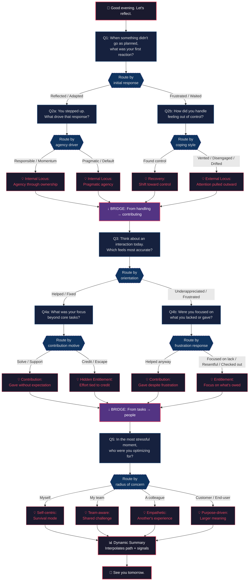

# Innerlytics — Decision Tree Architecture

```mermaid
flowchart TD
    classDef startEnd fill:#1a1a2e,stroke:#e94560,color:#fff,stroke-width:2px
    classDef question fill:#16213e,stroke:#0f3460,color:#e0e0e0,stroke-width:2px
    classDef decision fill:#0f3460,stroke:#533483,color:#e0e0e0,stroke-width:1px,stroke-dasharray:5
    classDef reflection fill:#1a1a2e,stroke:#e94560,color:#e94560,stroke-width:1px
    classDef bridge fill:#533483,stroke:#e94560,color:#fff,stroke-width:2px

    START["🌙 Good evening. Let's reflect."]:::startEnd

    A1_OPEN["Q1: When something didn't go as planned,<br/>what was your first reaction?"]:::question
    A1_D1{{"Route by<br/>initial response"}}:::decision

    A1_Q_HIGH["Q2a: You stepped up.<br/>What drove that response?"]:::question
    A1_Q_LOW["Q2b: How did you handle<br/>feeling out of control?"]:::question

    A1_D2{{"Route by<br/>agency driver"}}:::decision
    A1_D3{{"Route by<br/>coping style"}}:::decision

    A1_R_INT["💡 Internal Locus:<br/>Agency through ownership"]:::reflection
    A1_R_PRAG["💡 Internal Locus:<br/>Pragmatic agency"]:::reflection
    A1_R_REC["💡 Recovery:<br/>Shift toward control"]:::reflection
    A1_R_EXT["💡 External Locus:<br/>Attention pulled outward"]:::reflection

    BRIDGE_12["↓ BRIDGE: From handling → contributing"]:::bridge

    A2_OPEN["Q3: Think about an interaction today.<br/>Which feels most accurate?"]:::question
    A2_D1{{"Route by<br/>orientation"}}:::decision

    A2_Q_CONTRIB["Q4a: What was your focus<br/>beyond core tasks?"]:::question
    A2_Q_ENTITLE["Q4b: Were you focused on<br/>what you lacked or gave?"]:::question

    A2_D2{{"Route by<br/>contribution motive"}}:::decision
    A2_D3{{"Route by<br/>frustration response"}}:::decision

    A2_R_CONTRIB["💡 Contribution:<br/>Gave without expectation"]:::reflection
    A2_R_STRUGGLE["💡 Contribution:<br/>Gave despite frustration"]:::reflection
    A2_R_HIDDEN["💡 Hidden Entitlement:<br/>Effort tied to credit"]:::reflection
    A2_R_ENTITLE["💡 Entitlement:<br/>Focus on what's owed"]:::reflection

    BRIDGE_23["↓ BRIDGE: From tasks → people"]:::bridge

    A3_OPEN["Q5: In the most stressful moment,<br/>who were you optimizing for?"]:::question
    A3_D1{{"Route by<br/>radius of concern"}}:::decision

    A3_R_SELF["💡 Self-centric:<br/>Survival mode"]:::reflection
    A3_R_TEAM["💡 Team-aware:<br/>Shared challenge"]:::reflection
    A3_R_COLLEAGUE["💡 Empathetic:<br/>Another's experience"]:::reflection
    A3_R_ALTRO["💡 Purpose-driven:<br/>Larger meaning"]:::reflection

    SUMMARY["📊 Dynamic Summary<br/>Interpolates path + signals"]:::startEnd
    ENDNODE["🌙 See you tomorrow."]:::startEnd

    START --> A1_OPEN
    A1_OPEN --> A1_D1

    A1_D1 -->|"Reflected / Adapted"| A1_Q_HIGH
    A1_D1 -->|"Frustrated / Waited"| A1_Q_LOW

    A1_Q_HIGH --> A1_D2
    A1_Q_LOW --> A1_D3

    A1_D2 -->|"Responsible / Momentum"| A1_R_INT
    A1_D2 -->|"Pragmatic / Default"| A1_R_PRAG
    A1_D3 -->|"Found control"| A1_R_REC
    A1_D3 -->|"Vented / Disengaged / Drifted"| A1_R_EXT

    A1_R_INT --> BRIDGE_12
    A1_R_PRAG --> BRIDGE_12
    A1_R_REC --> BRIDGE_12
    A1_R_EXT --> BRIDGE_12

    BRIDGE_12 --> A2_OPEN
    A2_OPEN --> A2_D1

    A2_D1 -->|"Helped / Fixed"| A2_Q_CONTRIB
    A2_D1 -->|"Underappreciated / Frustrated"| A2_Q_ENTITLE

    A2_Q_CONTRIB --> A2_D2
    A2_Q_ENTITLE --> A2_D3

    A2_D2 -->|"Solve / Support"| A2_R_CONTRIB
    A2_D2 -->|"Credit / Escape"| A2_R_HIDDEN
    A2_D3 -->|"Helped anyway"| A2_R_STRUGGLE
    A2_D3 -->|"Focused on lack / Resentful / Checked out"| A2_R_ENTITLE

    A2_R_CONTRIB --> BRIDGE_23
    A2_R_STRUGGLE --> BRIDGE_23
    A2_R_HIDDEN --> BRIDGE_23
    A2_R_ENTITLE --> BRIDGE_23

    BRIDGE_23 --> A3_OPEN
    A3_OPEN --> A3_D1

    A3_D1 -->|"Myself"| A3_R_SELF
    A3_D1 -->|"My team"| A3_R_TEAM
    A3_D1 -->|"A colleague"| A3_R_COLLEAGUE
    A3_D1 -->|"Customer / End-user"| A3_R_ALTRO

    A3_R_SELF --> SUMMARY
    A3_R_TEAM --> SUMMARY
    A3_R_COLLEAGUE --> SUMMARY
    A3_R_ALTRO --> SUMMARY

    SUMMARY --> ENDNODE
```